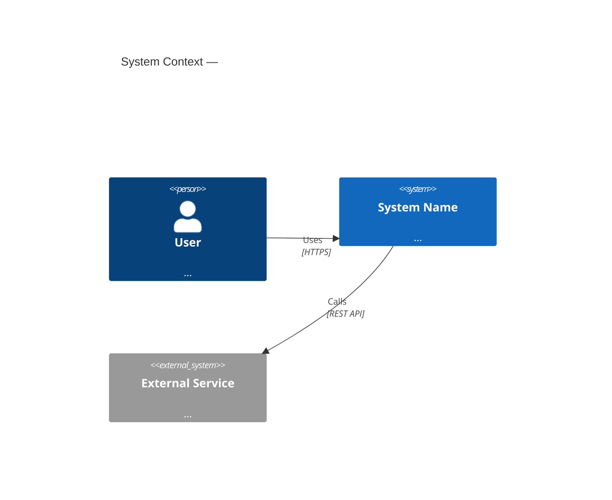

# Architecture

## When to use
- After requirements (`.claude/skills/requirements-engineering/SKILL.md`) and stack selection (`.claude/skills/stack-selection/SKILL.md`) are complete and their artifacts (`docs/requirements.md`, `docs/stack.md`) exist.
- Before phased build begins, so each phase has a concrete structural target to build toward.
- When a significant structural change is proposed: splitting a monolith into services, adding async processing, redesigning for multi-tenancy, adding a second region, introducing an ML inference layer, or any change that moves a trust or data boundary.
- When an inherited codebase needs an as-built architecture document before further development — reconstruct from code, then proceed.
- When a new companion system (from classification) comes into scope and its integration boundary must be designed.

Do not activate for feature implementation within an already-designed component. Architecture governs structure and boundaries; feature design governs behavior within those boundaries.

## Workflow

### 1. Extract the architectural drivers
From `docs/requirements.md` pull the NFRs that shape structure — these are the architectural drivers. Not all NFRs drive architecture; focus on the ones that force structural decisions:

- **Scale drivers** — peak concurrent users, data volume, write/read throughput targets. These determine whether you need horizontal scaling, read replicas, or sharding.
- **Latency drivers** — p95/p99 targets per flow. Sub-100ms requirements may force caching layers or edge deployment; sub-10ms may force in-process computation.
- **Availability drivers** — uptime SLA, RTO, RPO. 99.9% allows single-region active-passive; 99.99%+ typically requires multi-region active-active.
- **Security and trust boundaries** — what data is sensitive, who can see it, where encryption is required, what the auth perimeter is. These determine service boundaries and network topology.
- **Compliance drivers** — data residency, audit log requirements, HIPAA/PCI zones. These force specific deployment topology and storage decisions.
- **Team topology** — how many teams, what degree of independent deployability is required. Conway's Law is real: system boundaries follow team boundaries. If one team owns everything, a monolith is correct; if two teams must deploy independently, you need two deployable units.
- **Cost drivers** — budget ceiling per month at target scale. A system that exceeds budget at scale is not a viable architecture regardless of elegance.

Write the driver list explicitly. Every structural decision made later must trace back to at least one driver. If a structural complexity cannot be traced to a driver, it is premature.

### 2. Choose an architectural style
Select the style whose natural properties satisfy the drivers with the least accidental complexity. Do not choose a style because it is prestigious or because the team read about it.

| Style | Natural fit | When to avoid |
|---|---|---|
| **Modular monolith** | Single team, <10 engineers, fast iteration needed, domain boundaries not yet clear | When independent deployment by multiple teams is a hard requirement |
| **Layered (n-tier)** | CRUD-heavy systems, well-understood domain, small team | High-throughput event-driven systems; when layers become artificial pass-throughs |
| **Hexagonal / ports-and-adapters** | Domain logic that must be testable without infrastructure; multiple adapters (REST + gRPC + CLI + queue) for the same core | Small simple CRUD apps where the indirection adds no value |
| **Microservices** | Multiple autonomous teams requiring independent deployment and scaling; domain boundaries are clear and stable | Pre-product-market-fit; single team; unclear domain boundaries; no mature platform team |
| **Event-driven** | High-throughput async workflows; audit trail required; producers and consumers must evolve independently; fan-out patterns | Simple request-response flows where async adds latency without benefit |
| **Serverless / FaaS** | Highly variable or spiky load; event-triggered workloads; low ops overhead needed; cost scales to zero at idle | Long-running tasks; strict cold-start latency SLA; heavy stateful computation |
| **Client-server** | Traditional apps with a clear UI/logic split; well-understood RPC or REST boundary | When the "server" is actually the client's peer (P2P, local-first) |
| **Pipeline / ETL** | Data flows linearly through transforms; each step is independently replaceable | Interactive systems; when steps need to talk back upstream |
| **CQRS + Event Sourcing** | Audit trail is a first-class requirement; complex domain with multiple read models; regulatory replay needed | Simple CRUD; small teams unfamiliar with the pattern; when the domain does not benefit from event replay |

**Default position:** prefer the modular monolith for v1 of almost any product. It is faster to build, easier to debug, cheaper to operate, and easier to refactor into services once domain boundaries are proven by real usage. Add distribution only when a concrete driver forces it.

**Decision point — "should we split into services?"** Ask: (a) Do two different teams need to deploy this independently on different schedules? (b) Does one part need to scale independently by an order of magnitude? (c) Is there a hard security or compliance boundary that cannot be enforced within a single process? If the answer to all three is no, keep it together.

### 3. Define components and responsibilities
List every component (service, module, package, subsystem) in the architecture. For each one:

```
Component: <name>
Responsibility: <one sentence — what it owns and does>
Owned data: <which entities / tables / collections it is the authoritative source for>
Public interface: <how other components interact with it — HTTP API, event topics, shared library, gRPC, direct DB read>
Consumers: <which other components call or subscribe to it>
Dependencies: <which other components it calls or subscribes to>
Scaling axis: <how this component scales — stateless horizontal / stateful vertical / queue-depth-driven / fixed single instance>
```

**Boundary rule:** a component owns its data. No other component reads its database directly. Communication crosses the boundary only through the public interface. This is the single most enforced rule in clean architecture — violations here are the root cause of most "it worked until we needed to change it" failures.

If two components are sharing a database table with no explicit boundary, they are not two components — they are one component that has not been named as such yet.

### 4. Map the critical end-to-end flows
Choose 4–8 flows that cover the highest-value and highest-risk paths through the system. Typical candidates:

- User signup / account creation (auth path, identity creation, welcome email)
- Core transaction (the action the product is built around — publish, book, pay, submit, generate)
- Background job / async processing (what happens after the user action that the user doesn't see)
- Webhook / inbound event processing (if external systems push events in)
- Authentication and authorization check (what happens on every protected request)
- Data export / report generation (high-latency, high-volume path)
- Error and retry path (what happens when a dependency is down)

For each flow, produce a sequence:

```
Flow: <name>
Trigger: <what starts it>
Steps:
  1. [Actor/Component A] → [Component B]: <action/message/call>
     sync/async: <sync | async>
     data: <what is passed>
     side effects: <DB writes, events emitted, external calls>
  2. ...
  N. [Final state]: <what the system looks like when the flow completes>
Error path: <what happens if step K fails — retry, compensate, alert, surface to user>
```

Flows expose hidden coupling, missing error paths, and undocumented side effects. They are the most effective tool for finding design problems before code is written.

### 5. Design the cross-cutting layers centrally
Every system has concerns that apply everywhere. Design each one once, in a named place, so that individual features do not reinvent them inconsistently.

**Authentication / Authorization**
- Where tokens are issued, validated, and refreshed.
- Where authorization checks live (middleware, service layer, DB row-level security, or policy engine).
- What the authorization model is (RBAC / ABAC / ownership / ACL) and where it is enforced — not assumed.
- What happens when auth fails at each layer (HTTP 401 vs. 403, logged or not, rate-limited or not).

**Input validation and sanitization**
- Where validation runs (edge/gateway, controller layer, domain layer).
- What the validation contract is for external inputs (all external data is untrusted until validated).
- Where SQL injection, XSS, command injection, and path traversal defenses live.

**Error handling and observability**
- Error taxonomy: expected errors (validation, not-found, permission) vs. unexpected errors (panics, infra failures).
- Where errors are logged, with what context (trace ID, user ID, request ID, stack trace).
- What is surfaced to the end user vs. what is internal.
- Where structured logs, metrics, and distributed traces are emitted. Every component must emit; none may silence errors.

**Configuration and secrets**
- Where environment-specific config lives (env vars, config map, secrets manager).
- How secrets are injected (never in code, never in logs, never in error messages).
- How config is validated at startup so a misconfigured deployment fails fast rather than silently misbehaving.

**Caching**
- What is cached, at which layer (CDN edge, in-process, distributed cache), for how long.
- Cache invalidation strategy for each cached resource.
- What happens on cache miss (thundering herd protection).

**Rate limiting and abuse prevention**
- Where rate limits are enforced (edge/gateway vs. service layer).
- What the limits are per actor type (anonymous, authenticated, API key).
- What the response is when a limit is hit (429 with Retry-After, log, alert).

**Background jobs and queuing**
- Job queue technology and retry policy (max attempts, backoff, dead-letter).
- Idempotency contract for all jobs (what key, what dedup window).
- How job failures surface in observability.

### 6. Satisfy each architectural driver explicitly
For every driver extracted in step 1, write a one-paragraph architecture response:

**Scalability:** which components scale horizontally (stateless, behind a load balancer), which scale vertically (stateful single instance), where the first bottleneck is, and at what load that bottleneck appears. Name the scaling axis for each component.

**Availability:** where redundancy exists (multiple instances, replica databases, multi-AZ), what the failover mechanism is (health check + LB, read replica promotion, circuit breaker), and how the stated RTO/RPO is achieved. If there is a planned maintenance window, how it is implemented without downtime.

**Security:** trust boundaries mapped (what is the perimeter, where is encryption applied, what data crosses each boundary and how it is protected). Threat surface: what is public-facing, what is internal-only, what requires mTLS or VPN. Reference `.claude/checklists/security.md` and ensure every item at P0 is addressed by a component.

**Data integrity:** where transactions are used (what is atomic), where eventual consistency is accepted (and what the maximum staleness is), where idempotency is enforced, how duplicate events / duplicate requests are handled.

**Disaster recovery:** where data is backed up, how often, to which location, how restore is tested. What the actual restore path is (not just "backups exist" — the step-by-step procedure). How RTO is measured.

**Cost at scale:** estimate the monthly cost at target-peak load for the primary components (compute, storage, egress, third-party APIs). Flag any component where cost scales super-linearly with load.

### 7. Produce text-based diagrams
Create at minimum:

**Context diagram (C4 Level 1):** The system as a black box, its users (human actors), and its external dependencies (third-party services, other systems). Shows trust and data boundaries at the highest level.

**Container diagram (C4 Level 2):** The deployable units inside the system (services, frontends, databases, queues, caches), their responsibilities, and the connections between them (protocol, sync/async, data shape).

For complex systems, add:

**Component diagram (C4 Level 3):** The internal modules of one container, showing the major code-level components and how they relate.

**Sequence diagrams:** For the critical flows from step 4 where the interaction order is non-obvious.

Use Mermaid or PlantUML exclusively. Do not produce screenshots, image files, or links to external diagram tools. Diagrams that live in version control as text are the only diagrams that stay accurate. A Mermaid flowchart in a markdown file can be diffed, reviewed, and updated in the same PR that changes the code.



### 8. Record trade-offs, risks, and ADRs
For every significant structural decision, write an ADR at `docs/adr/NNNN-<slug>.md` using `.claude/templates/decision-record.md`. At minimum, cover:

- Choice of architectural style (step 2)
- Each non-obvious component boundary (why is this a separate component rather than part of its neighbor?)
- Sync vs. async for each critical inter-component communication
- Caching strategy for any cached resource
- Data consistency model (where eventual consistency is accepted)
- Any design decision that sacrifices one driver to satisfy another (e.g. "we accept higher latency on the export flow to keep the OLTP database simple")

For each trade-off, explicitly state: what was gained, what was given up, and what future condition would force a revisit.

Maintain a **risks register** in the architecture document:

| Risk | Likelihood | Impact | Mitigation | Owner |
|------|-----------|--------|-----------|-------|

Do not omit risks to make the design look cleaner. Known risks that are documented can be mitigated; unknown risks cause incidents.

### 9. Define the phased build plan
Break the architecture into phases where each phase:
- Is independently deployable and testable (a real slice, not half a layer)
- Delivers observable value or unblocks the next phase
- Has defined acceptance criteria (what must be true for this phase to be considered done)
- Can be reverted if it introduces a regression (rollback plan or feature-flag)

Typical phase structure:

```
Phase 1: Foundation — auth, data model, CI/CD, observability skeleton, health checks.
  Acceptance: authenticated user can sign in; structured logs flowing to observability platform; CI green.

Phase 2: Core transaction — the single flow that is the product's reason for existing.
  Acceptance: [FR-001 through FR-012 implemented and passing acceptance tests]; p95 latency < Xms under synthetic load.

Phase 3: Supporting flows — notifications, background jobs, secondary CRUD.
  Acceptance: ...

Phase N: Hardening — performance tuning, security hardening, DR test, load test, accessibility audit.
  Acceptance: all P0 checklist items green; load test at 2x peak passes; DR restore tested.
```

Phases that are too large to ship safely are not phases — they are an undecomposed big bang. If a phase cannot be reviewed and deployed within a week of starting it, split it.

### 10. Document and hand off
Finalize `docs/architecture.md` using `.claude/templates/architecture.md`. Run `.claude/checklists/architecture.md` before declaring done.

Hand off to:
- `.claude/skills/data-modeling/SKILL.md` — receives the component/ownership map and the consistency/availability constraints.
- `.claude/skills/api-design/SKILL.md` — receives the component interfaces and the sync/async decisions.
- `.claude/skills/security/SKILL.md` — receives the trust boundaries and threat surface for threat modeling.
- `.claude/agents/core/technical-lead.md` — receives the phased build plan to decompose into tasks.

## Standards

- **Do** keep the design as simple as the drivers allow. Complexity must be earned by a specific NFR or team-topology requirement — not imported from a reference architecture built for a different scale.
- **Do** make trust and data boundaries explicit in every diagram and document. They drive security review, compliance audit, and the contracts between teams.
- **Do** design for observability from the first line of architecture: structured logs, distributed traces, metrics, and health check endpoints are not optional additions — they are load-bearing infrastructure.
- **Do** prefer reversible structural decisions. Isolate irreversible ones (database choice, wire protocol, external API contract) behind explicit interfaces so the blast radius of a wrong decision is bounded.
- **Do** version all diagrams as text in the repository. A diagram that cannot be diffed will drift from the code within weeks.
- **Do** address failure modes explicitly in every flow. "Happy path only" architecture documents describe a system that does not exist in production.
- **Do not** introduce microservices, multiple datastores, message buses, or separate deployment units without a driver that requires them. The burden of proof is on distribution, not on consolidation.
- **Do not** scatter cross-cutting concerns. Auth, validation, logging, rate limiting, and error handling must live in named, centralized places — not be re-implemented per feature.
- **Do not** design only the successful path. Every component needs a stated failure behavior: what happens when it is down, slow, or returning errors.
- **Do not** skip the phased build plan. A correct architecture with no delivery plan is a design exercise, not a project plan.

## Common mistakes to avoid

- **Premature distribution.** Splitting into services before the domain boundaries are understood and stable. The most expensive refactor in software is collapsing badly-drawn service boundaries. Build the monolith first; extract services when you have data about what actually needs to be independent.
- **Hidden coupling via shared database.** Two services that both write to the same table have no real boundary. One query from service B reaching directly into service A's tables is enough to couple their deployments, their schemas, and their failure modes forever.
- **No documented scaling story.** "We'll scale it when we need to" is not a plan. If the architecture cannot explain where the first bottleneck appears and what the response is, it has not been designed for scale — it has been designed for today and hoped for tomorrow.
- **Diagrams in external tools.** A Lucidchart or Miro diagram that is not in the repo will be out of date within one sprint. Use Mermaid or PlantUML, commit it, and review it in PRs.
- **Security as an add-on.** Treating auth, encryption, and trust boundaries as something to layer on after the "real" architecture is done. Security boundaries must be baked into the component topology. Retrofitting them means redesigning the topology.
- **Phases that are too large.** A "phase" that takes three months and cannot be rolled back is a waterfall release with a new name. Each phase must be independently valuable, independently deployable, and independently reversible.
- **Optimizing for the wrong bottleneck.** Adding a cache, a CDN, and read replicas before profiling the actual system. The bottleneck is almost always not where you think it is. Design for measurability first; optimize after measurement.
- **Missing the async failure path.** Every async operation (queue consumer, webhook delivery, background job) has a failure mode that synchronous operations do not. If the architecture document does not describe the dead-letter queue, retry policy, and alert condition for every async component, it is incomplete.
- **No component ownership.** An architecture where every component can read and write every other component's data has no architecture — it has a big ball of mud with latency. Ownership must be explicit and enforced.

## Output format

A completed `.claude/templates/architecture.md` saved at `docs/architecture.md` containing:

1. **Architectural drivers** — the NFRs and constraints that shaped the design (from step 1).
2. **Chosen style** — named style with rationale and reference to the driver(s) that required it.
3. **Component table** — `component | responsibility | owned data | public interface | scaling axis`.
4. **Critical flows** — 4–8 sequence narratives or Mermaid sequence diagrams.
5. **Cross-cutting layer design** — auth, validation, error handling, observability, config/secrets, caching, rate limiting, background jobs — each as a named section.
6. **Driver satisfaction** — scalability, availability, security, data integrity, DR, cost — each as a paragraph.
7. **Diagrams** — C4 Level 1 context + Level 2 container, both as Mermaid/PlantUML in the document.
8. **Trade-offs and risks register** — explicit gains/losses for each major decision; risks table.
9. **ADR index** — links to `docs/adr/NNNN-*.md` for each structural decision.
10. **Phased build plan** — phases with acceptance criteria and rollback notes.

## Related checklists
- `.claude/checklists/architecture.md`
- `.claude/checklists/security.md`
- `.claude/checklists/performance.md`
- `.claude/checklists/production.md`
- `.claude/checklists/devops.md`

## Related agents
- `.claude/agents/core/solution-architect.md`
- `.claude/agents/core/technical-lead.md`
- `.claude/agents/core/orchestrator.md`
- `.claude/agents/quality/security-auditor.md`
- `.claude/agents/quality/performance-engineer.md`
- `.claude/agents/quality/reliability-engineer.md`
- `.claude/agents/quality/production-readiness-auditor.md`
